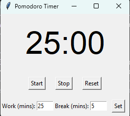

# Pomodoro Timer

A simple, desktop-based Pomodoro timer application built with Python and `tkinter`.

The Pomodoro Technique is a time management method that uses a timer to break down work into intervals, traditionally 25 minutes in length, separated by short breaks. This application helps you stay focused and manage your time effectively.



## Features

*   **Customizable Timers:** Set custom durations for work and break sessions.
*   **Simple Interface:** An easy-to-use graphical user interface.
*   **Notifications:** Get notified when a work or break session is over.

## Getting Started

### Prerequisites

*   Python 3.10+

### Setup

It is recommended to use a virtual environment to run this project.

1.  Create a virtual environment:
    ```bash
    python -m venv venv
    ```
2.  Activate the virtual environment:
    *   On Windows:
        ```bash
        .\venv\Scripts\activate
        ```
    *   On macOS and Linux:
        ```bash
        source venv/bin/activate
        ```

### Running the Application

To run the application, execute the following command from the root directory of the project:

```bash
python -m app.main
```

### Running Tests

To run the unit tests, execute the following command from the root directory of the project:

```bash
python -m unittest discover tests
```

## Development

The development dependencies are listed in `requirements-dev.txt`. To install them in a virtual environment, run:
```bash
pip install -r requirements-dev.txt
```

## License

This project is licensed under the MIT License - see the [LICENSE](LICENSE) file for details.
